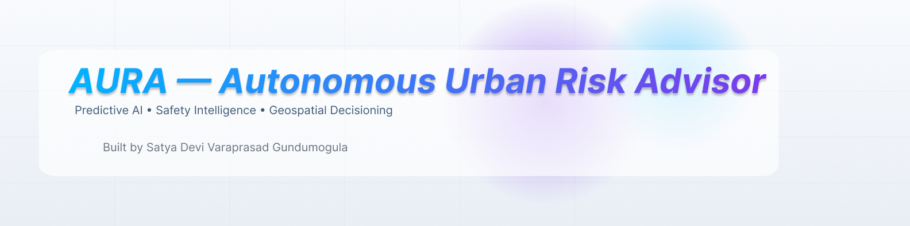
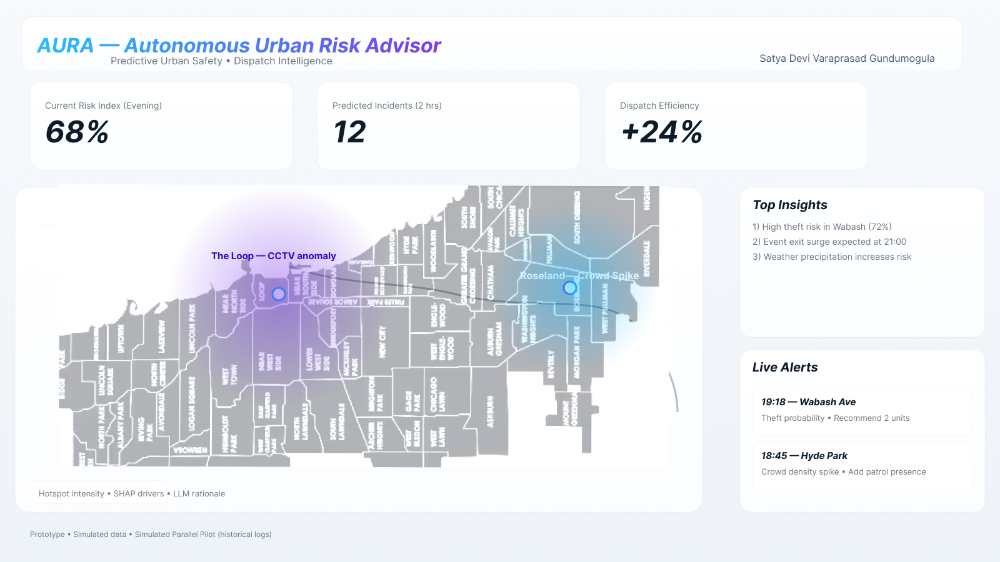
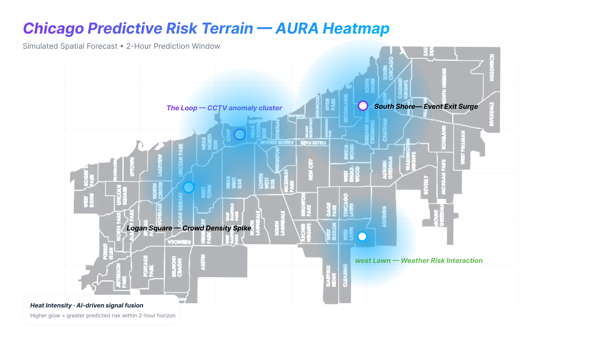
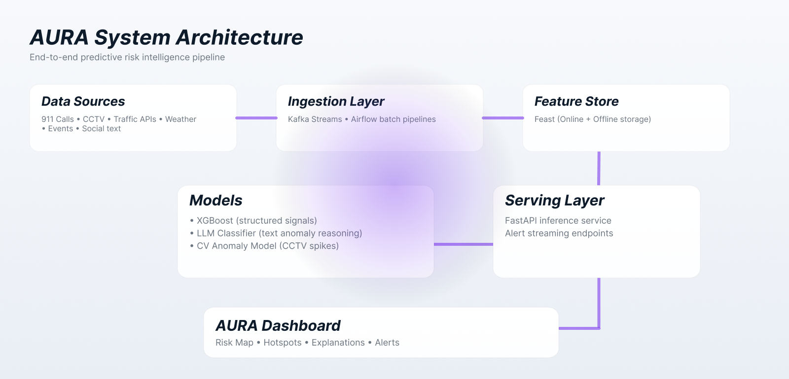

<!-- HERO HEADER -->
<p align="center">
  
</p>

<p align="center">
  <strong>AI-powered early-warning system for emergency dispatch optimization</strong>
</p>

---

# 🚀 Overview

AURA is a **predictive urban safety intelligence platform** that forecasts high-risk events 90–120 minutes in advance.  
It fuses real-time signals from **911 calls, CCTV, weather, traffic, and city events** to support tactical decision-making for emergency dispatch and city operations.

Designed as a full **AI Product Management case study**, AURA demonstrates:

- Product vision  
- Technical architecture  
- AI system design  
- Risk modeling  
- Prototyping  
- KPI framing  
- Business impact evaluation  

---

# 🧭 Problem

Major U.S. cities struggle with:

- Delayed response times  
- Poor situational awareness  
- Resource misallocation  
- Limited predictive capabilities  
- Inefficient manual decision workflows  

Emergency dispatch centers operate **reactively**.  
AURA shifts this paradigm to **proactive prediction and pre-positioning**.

---

# 💡 Solution: AURA

AURA forecasts high-risk zones using:

### ✔ Multimodal risk scoring  
- XGBoost classifier (structured signals)  
- LLM event classifier (text/log reasoning)  
- CV anomaly model (CCTV activity spikes)  

### ✔ Real-time data fusion  
Streaming ingestion + batch enrichment.

### ✔ SHAP + LLM hybrid explanations  
Human-readable insights for command operators.

### ✔ Interactive operational dashboard  
Live map, risk tiers, anomaly clusters, and dispatch recommendations.

---

# 🗺️ Live Dashboard Preview

<p align="center">
  
</p>

---

# 🌡️ Predictive Heatmap (Chicago)

<p align="center">
  
</p>

---

# 🧠 System Architecture

<p align="center">
  
</p>

---

# 📊 Key Outcomes (Simulated Pilot)

| KPI | Baseline | AURA MVP | Impact |
|-----|----------|-----------|--------|
| Average response latency | 24 min | **18–19 min** | ↓ **20–25%** |
| Dispatch efficiency | — | **+24%** | Improved route allocation |
| High-risk detection recall | — | **~82%** | Increased situational accuracy |

**Methodology:** Simulated parallel pilot using historical Chicago 911 logs; AURA predictions compared against actual outcomes.

---

# 🧩 AURA Architecture Components

### **1. Data Sources**
911 calls, weather data, traffic APIs, events, social text, CCTV anomaly counts.

### **2. Ingestion Layer**
Kafka-style streaming + scheduled ETL for enrichment.

### **3. Feature Store**
Feast-based offline + online store for unified feature schemas.

### **4. Modeling Layer**
- XGBoost classifier  
- LLM-based context reasoning  
- CV spike detector for camera activity  

### **5. Serving Layer**
FastAPI inference · ranking service · alerting microservice.

### **6. UX Layer**
Operational dashboard with risk scores, explanations, and recommendations.

---

# 🧪 Notebooks

The `notebooks/` folder includes:

- **AURA_simulation_advanced.ipynb**

This notebook demonstrates:

- Synthetic event generation  
- Feature engineering  
- Model training + scoring  
- SHAP analysis  
- Hotspot clustering  
- Visualization generation  

Run using:

```bash
pip install -r requirements.txt
jupyter notebook
```

---

# 📁 Repository Structure

```
AURA/
│
├── assets/                # PNG exports for README
├── prototype/             # Interactive dashboard HTML
├── docs/                  # Case studies + PDF export
├── design-system/         # Branding + UI system
├── notebooks/             # Simulation + analytics
└── README.md
```

---

# 🔐 Ethical & Governance Safeguards

AURA is designed with responsible AI practices:

- Models exclude demographic features  
- Fairness evaluation across neighborhoods  
- SHAP explanations for transparency  
- Operational review loop for human oversight  
- Bias mitigation through calibration  

This section is crucial for modern AI PM interviews and corporate trust requirements.

---

# 🗂️ Case Studies & Documentation

| File | Description |
|------|-------------|
| `AURA_case_study_exec_FINAL_UPDATED.html` | Executive-level framing & KPIs |
| `AURA_case_study_deep_FINAL_UPDATED.html` | Full technical case study |
| `AURA_Design_System_UPDATED.html` | AURA style & branding kit |
| `AURA_Prototype_v3_FINAL_UPDATED.html` | Interactive prototype |

---

# 🎯 Product Strategy Roadmap

### **Phase 1 — MVP**
- Structured model (XGBoost)  
- LLM-enhanced event classification  
- Basic risk tiers  
- Operational dashboard  

### **Phase 2 — Enterprise Push**
- Automated patrol routing  
- Multi-agency integration  
- Predictive staffing recommendations  
- Near real-time CCTV pipeline  

### **Phase 3 — Advanced AI**
- Reinforcement learning for dispatch optimization  
- Sequence modeling (Temporal AI)  
- Cross-city generalization  
- Federated model training  

---

# 🧑‍💼 About the Creator

**Satya Devi Varaprasad Gundumogula**  
M.S. Information Systems — AI Product & Data Strategy  
Chicago, IL  

Focus areas:

- AI Product Management  
- Predictive Analytics  
- Geospatial Intelligence  
- Enterprise Systems Design  

---

# 📬 Contact

**LinkedIn:**  
**GitHub:** https://github.com/satya1118  

---

<p align="center">
  <sub>© 2025 AURA — Autonomous Urban Risk Advisor</sub>
</p>
