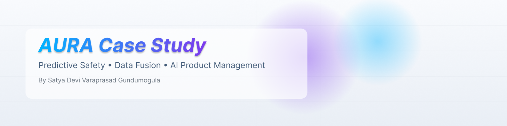

<!-- =============================== -->
<!-- 🔮 AURA AGENTIC AI FLOW -->
<!-- =============================== -->

<p align="center">
  
</p>

# 🔮 AURA Agent — Agentic AI Execution Flow

> **Autonomous decision-making system for real-time urban risk intelligence**

---

## 🧠 High-Level Concept

AURA operates as a **continuous cognitive loop** — not a linear pipeline.  
The agent **perceives**, **reasons**, **decides**, **acts**, and **reflects**, with human oversight built in.

---

## ⚡ Futuristic Agentic Flow (System View)

```mermaid
flowchart LR
    %% DATA SOURCES
    subgraph S[🌐 Live Urban Signals]
        A1[📞 911 Calls]
        A2[🎥 CCTV CV Anomalies]
        A3[🚦 Traffic Flow]
        A4[🌧️ Weather]
        A5[🎟️ Events]
    end

    %% INGESTION
    subgraph I[⚙️ Signal Fusion Layer]
        B1[ETL & Streaming]
        B2[Feature Store]
    end

    %% MODELS
    subgraph M[📊 Risk Intelligence]
        C1[XGBoost Risk Model]
        C2[Spatial Clustering]
        C3[Temporal Patterns]
    end

    %% AGENT
    subgraph AG[🧠 AURA Agent]
        D1[Short-Term Memory]
        D2[Reasoning Engine]
        D3[Confidence Gates]
        D4[Action Planner]
    end

    %% ACTIONS
    subgraph O[🚨 Operational Outputs]
        E1[Dashboard Alerts]
        E2[Hotspot Updates]
        E3[Dispatch Recommendations]
    end

    %% EXPLAINABILITY
    subgraph X[💬 Explainability Layer]
        F1[SHAP Drivers]
        F2[LLM Rationale]
        F3[Audit Logs]
    end

    %% HUMAN
    subgraph H[🧑‍⚖️ Human-in-the-Loop]
        G1[Supervisor Review]
        G2[Override / Approve]
    end

    %% FLOW
    A1 --> B1
    A2 --> B1
    A3 --> B1
    A4 --> B1
    A5 --> B1

    B1 --> B2
    B2 --> C1
    B2 --> C2
    B2 --> C3

    C1 --> D2
    C2 --> D2
    C3 --> D2

    D1 --> D2
    D2 --> D3
    D3 --> D4

    D4 --> E1
    D4 --> E2
    D4 --> E3

    D4 --> F1
    F1 --> F2
    F2 --> F3

    D4 --> G1
    G1 --> G2
    G2 --> D1
